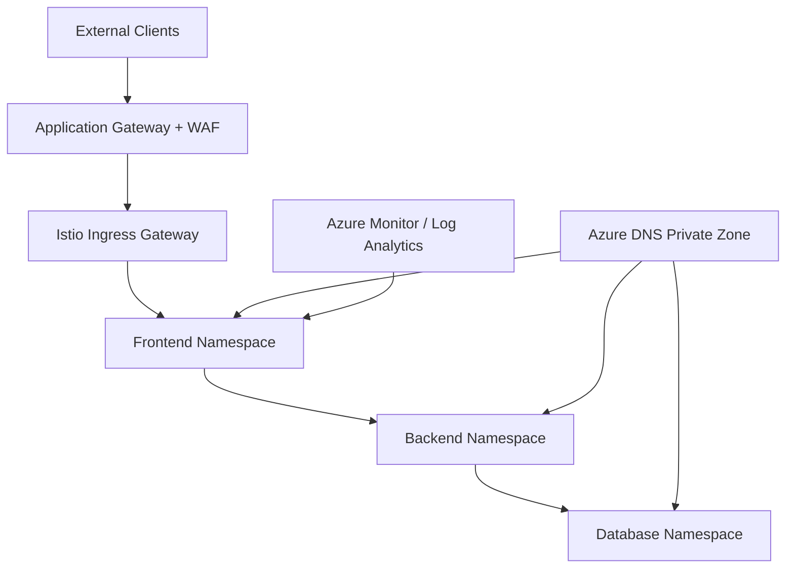

# Zero-Trust Microservices Segmentation on Azure AKS

Expert Azure lab implementation: **AKS + Istio service mesh**, **Azure DNS Private Zones**, **Application Gateway (WAF)**, and **Azure Monitor** for zero-trust microsegmentation across frontend, backend, and database tiers.


---

## Overview

Enterprise microservices often fail at **service-to-service security** — flat cluster networking, weak ingress controls, and no mTLS. This project deploys a **zero-trust** pattern on Azure:

- **AKS** with managed **Istio** (sidecar injection, mTLS, AuthorizationPolicies)
- **Namespace isolation** via default-deny NetworkPolicies
- **Azure DNS Private Zones** for internal service discovery (`company.internal`)
- **Application Gateway + WAF** for controlled north-south traffic
- **Log Analytics / Azure Monitor** for observability and alerting

Complements my [Kubernetes Microservices on AWS EKS](https://github.com/SergioSediq/kubernetes-eks-microservices) project for a **multi-cloud Kubernetes** narrative.

**Estimated lab time:** ~150 minutes | **Difficulty:** Expert

---

## Architecture



See [docs/ARCHITECTURE.md](docs/ARCHITECTURE.md) and the full step-by-step [docs/LAB_GUIDE.md](docs/LAB_GUIDE.md).

---

## What's included

| Path | Description |
|------|-------------|
| `terraform/` | Full IaC: AKS, VNet, DNS, App Gateway, sample apps, Istio policies |
| `bicep/` | Azure-native alternative deployment |
| `scripts/` | `deploy.sh`, `destroy.sh` automation |
| `docs/LAB_GUIDE.md` | Complete Expert lab walkthrough |

---

## Quick start (Terraform)

### Prerequisites

- Azure subscription (Contributor or Owner)
- [Azure CLI](https://learn.microsoft.com/en-us/cli/azure/install-azure-cli) 2.50+
- [Terraform](https://developer.hashicorp.com/terraform/install) 1.5+
- `kubectl` configured after deploy

```bash
az login
cd terraform
terraform init
terraform plan
terraform apply

# Configure cluster access
az aks get-credentials \
  --resource-group $(terraform output -raw resource_group_name) \
  --name $(terraform output -raw aks_cluster_name)
```

### Validate

```bash
kubectl get pods -A
kubectl get authorizationpolicy -A
kubectl get networkpolicy -A
```

### Cleanup

```bash
terraform destroy
# or: ./scripts/destroy.sh
```

---

## Security controls enforced

| Control | Implementation |
|---------|------------------|
| Microsegmentation | Istio AuthorizationPolicies (frontend → backend → database only) |
| Encryption in transit | Istio mTLS (`ISTIO_MUTUAL` DestinationRules) |
| Namespace isolation | Default-deny Kubernetes NetworkPolicies |
| Ingress protection | Application Gateway WAF (OWASP 3.2) |
| Private discovery | Azure DNS Private Zone linked to VNet |
| Monitoring | Container Insights + metric alerts |

---

## Author

**Sergio Sediq**

- [GitHub](https://github.com/SergioSediq)
- [LinkedIn](https://www.linkedin.com/in/sedyagho/)
- sediqsergio@gmail.com

---

## Attribution

Infrastructure recipes and IaC adapted from [mzazon/cloud-projects](https://github.com/mzazon/cloud-projects) ([cloudprojects.dev](https://cloudprojects.dev/)). Extended and documented for portfolio use.

## License

MIT — see [LICENSE](LICENSE).
