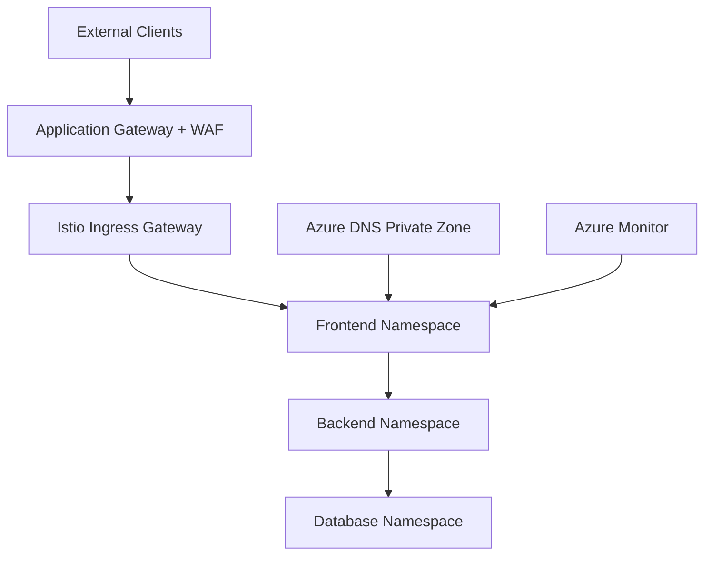

# 🔐 Zero-Trust Microservices Platform on Azure AKS

Production-ready zero-trust microservices on Azure AKS with Istio service mesh, private DNS, Application Gateway WAF, and Azure Monitor for regulated enterprise workloads.


---

## 🔍 Overview

Enterprise-grade zero-trust microservices platform on **Azure Kubernetes Service (AKS)**, demonstrating service mesh security, namespace microsegmentation, and controlled ingress for banking-style regulated environments. Features mutual TLS, default-deny network policies, and full observability through Azure Monitor.

**Key Achievements:**
- ✅ 3-tier microservices (frontend, backend, database) with Istio sidecar injection
- ✅ Zero-trust service-to-service communication with mTLS and AuthorizationPolicies
- ✅ Namespace isolation via default-deny Kubernetes NetworkPolicies
- ✅ Azure DNS Private Zones for secure internal service discovery
- ✅ Application Gateway with WAF for controlled north-south traffic
- ✅ Log Analytics and Azure Monitor alerting for mesh observability

---

## 🏛️ Architecture

### Microservices Design

**Core Tiers:**
- **Frontend Namespace**: Public-facing microservice tier behind Istio ingress
- **Backend Namespace**: Business logic tier with restricted upstream/downstream access
- **Database Namespace**: Data tier accessible only from backend services

**Infrastructure:**
- **AKS Cluster**: Managed Kubernetes with Azure CNI and network policy
- **Istio Service Mesh**: Managed Istio add-on with ingress gateway and mTLS
- **Azure DNS Private Zone**: Internal DNS (`company.internal`) linked to VNet
- **Application Gateway**: WAF-enabled ingress (OWASP 3.2)
- **Log Analytics Workspace**: Centralized logs and Container Insights
- **Virtual Network**: Segmented subnets for AKS, App Gateway, and private endpoints

**Supporting Components:**
- Terraform and Bicep Infrastructure as Code
- Sample deployments with Istio Gateway and VirtualService
- DestinationRules enforcing `ISTIO_MUTUAL` TLS mode
- Azure Monitor metric alerts for cluster health



📖 **Further reading:** [docs/ARCHITECTURE.md](docs/ARCHITECTURE.md) · [docs/LAB_GUIDE.md](docs/LAB_GUIDE.md)

---

## ✨ Features

### Zero-Trust Networking
- **Istio Service Mesh:** Sidecar injection, mTLS, and fine-grained authorization
- **Microsegmentation:** Frontend → backend → database path only
- **Default-Deny Policies:** NetworkPolicies block all traffic until explicitly allowed
- **Private DNS:** Internal service discovery without public exposure
- **WAF Ingress:** Application Gateway filters malicious north-south traffic

### Container Orchestration
- **AKS Managed Kubernetes:** Auto-scaling node pools (2–10 nodes)
- **Azure CNI:** Native VNet integration with network policy support
- **Multi-Namespace Design:** Tiered isolation for frontend, backend, database
- **Health Probes:** Liveness and readiness checks on sample workloads

### Security
- **AuthorizationPolicies:** Istio rules restricting namespace-to-namespace calls
- **mTLS Everywhere:** Encrypted service-to-service communication
- **Private Cluster Option:** Configurable API server access restrictions
- **Managed Identity:** System-assigned identity for Azure resource access
- **NSG Rules:** Subnet-level traffic filtering

### Monitoring & Logging
- **Container Insights:** Pod and node metrics via Log Analytics
- **Metric Alerts:** Proactive notifications on cluster stress
- **Centralized Logging:** Unified workspace for audit and troubleshooting
- **Istio Telemetry:** Traffic flow visibility across mesh

---

## 📊 Results

| Metric | Value | Impact |
|--------|-------|--------|
| **Service Tiers** | 3 namespaces | Clear blast-radius isolation |
| **Encryption** | 100% mesh traffic | mTLS on all service hops |
| **Ingress Protection** | WAF enabled | OWASP 3.2 rule set |
| **DNS** | Private zone | No public service enumeration |
| **Deploy Time** | ~20 minutes | Full stack via Terraform |
| **Lab Duration** | ~150 minutes | Expert-grade hands-on path |

**Security Posture:**
- **Unauthorized paths blocked:** Database cannot call frontend directly
- **Ingress funneled:** All external traffic through App Gateway + Istio gateway
- **Policy-as-code:** Network and mesh policies defined in Terraform/kubectl manifests

---

## 🖥️ How to Run

### Prerequisites
- Azure subscription with Contributor or Owner access
- Azure CLI 2.50+
- Terraform 1.5+
- kubectl installed
- Bash shell (for deploy scripts on Linux/macOS/WSL)

### Quick Start

**1. Clone Repository**
```bash
git clone https://github.com/SergioSediq/azure-aks-zero-trust-service-mesh.git
cd azure-aks-zero-trust-service-mesh
```

**2. Deploy with Terraform**
```bash
az login
cd terraform
terraform init
terraform plan
terraform apply
```

**Expected Runtime:** ~15–20 minutes

**Output:** AKS cluster, VNet, DNS Private Zone, Application Gateway, Log Analytics, sample apps

**3. Configure kubectl**
```bash
az aks get-credentials \
  --resource-group $(terraform output -raw resource_group_name) \
  --name $(terraform output -raw aks_cluster_name)
kubectl get nodes
```

**4. Verify Mesh and Policies**
```bash
kubectl get pods -A
kubectl get authorizationpolicy -A
kubectl get networkpolicy -A
kubectl get destinationrule -A
```

**5. Validate Segmentation**
```bash
# Authorized path (frontend → backend) should succeed
kubectl exec -n frontend deploy/frontend-service -- \
  curl -s http://backend-service.company.internal

# Unauthorized path should fail
kubectl exec -n database deploy/database-service -- \
  curl -s http://frontend-service.company.internal
```

### Alternative: Bicep Deployment
```bash
cd bicep
az deployment group create \
  --resource-group rg-advanced-network-segmentation \
  --template-file main.bicep \
  --parameters parameters.json
```

### Cleanup
```bash
cd terraform
terraform destroy
# or: ./scripts/destroy.sh
```

---

## 📦 Technologies

**Container Orchestration:**
- Azure Kubernetes Service (AKS)
- Istio Service Mesh (managed add-on)
- kubectl

**Azure Services:**
- Azure DNS Private Zones
- Application Gateway (WAF v2)
- Log Analytics / Azure Monitor
- Virtual Network & Network Security Groups
- Managed Identities

**Infrastructure as Code:**
- Terraform 1.5+
- Azure Bicep

**Languages:**
- HCL (Terraform)
- Bicep
- YAML (Kubernetes / Istio manifests)

---

## 📁 Project Structure

```
azure-aks-zero-trust-service-mesh/
├── terraform/                 # Primary IaC deployment
│   ├── main.tf               # AKS, VNet, DNS, App Gateway, mesh policies
│   ├── variables.tf
│   ├── outputs.tf
│   └── versions.tf
├── bicep/                     # Azure-native alternative
│   ├── main.bicep
│   └── parameters.json
├── scripts/
│   ├── deploy.sh
│   └── destroy.sh
├── docs/
│   ├── ARCHITECTURE.md       # Architecture summary
│   └── LAB_GUIDE.md          # Full step-by-step lab guide
├── README.md
├── LICENSE
└── .gitignore
```

---

## 💡 Key Features Demonstrated

### Zero-Trust Architecture
- Never trust, always verify between services
- Explicit allow lists at mesh and network layers
- Least-privilege namespace communication paths

### Service Mesh on Azure
- Managed Istio on AKS without self-hosted control plane ops
- Gateway, VirtualService, DestinationRule, AuthorizationPolicy patterns
- Production-style tiered microservices layout

### Regulated Enterprise Patterns
- Private internal DNS for service discovery
- WAF-protected ingress for external clients
- Audit-friendly centralized logging

---

## 🎯 Use Cases

**For Platform Engineers:**
- Reference architecture for AKS + Istio zero-trust designs
- Terraform modules for repeatable Azure K8s security baselines
- Multi-namespace segmentation templates

**For Security Teams:**
- Demonstrate mTLS and microsegmentation in interviews
- Show WAF + mesh defense-in-depth
- Compliance-oriented network isolation patterns

**For Financial Services:**
- Banking-style tiered microservices (frontend / API / data)
- Aligns with Azure workloads at regulated institutions
- Pairs with [AWS EKS microservices](https://github.com/SergioSediq/kubernetes-eks-microservices) for multi-cloud K8s story

---

## 🔮 Future Enhancements

- [ ] Azure Key Vault integration for TLS certificates
- [ ] OPA Gatekeeper policy enforcement
- [ ] Private AKS cluster with Azure Private Link
- [ ] Kiali / Grafana dashboards for mesh visualization
- [ ] GitOps with Flux or Argo CD
- [ ] Azure Front Door as global ingress layer
- [ ] Pod Security Standards and Azure Policy add-on hardening

---

## 📧 Contact

**Sergio Sediq**  
📧 sediqsergio@gmail.com  
🔗 [LinkedIn](https://linkedin.com/in/sedyagho) | [GitHub](https://github.com/SergioSediq)

---

## 📄 License

This project is open source and available under the MIT License.

---

⭐ **Star this repo if you found it helpful!**

*Built with ❤️ for zero-trust cloud-native microservices on Azure*
